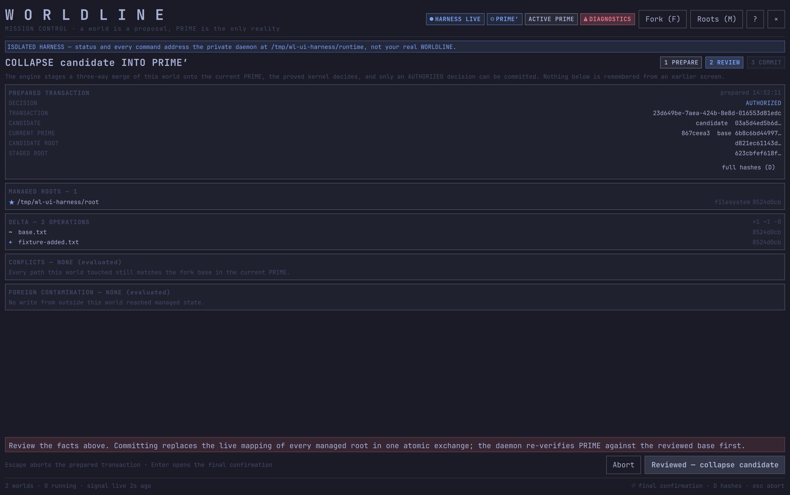
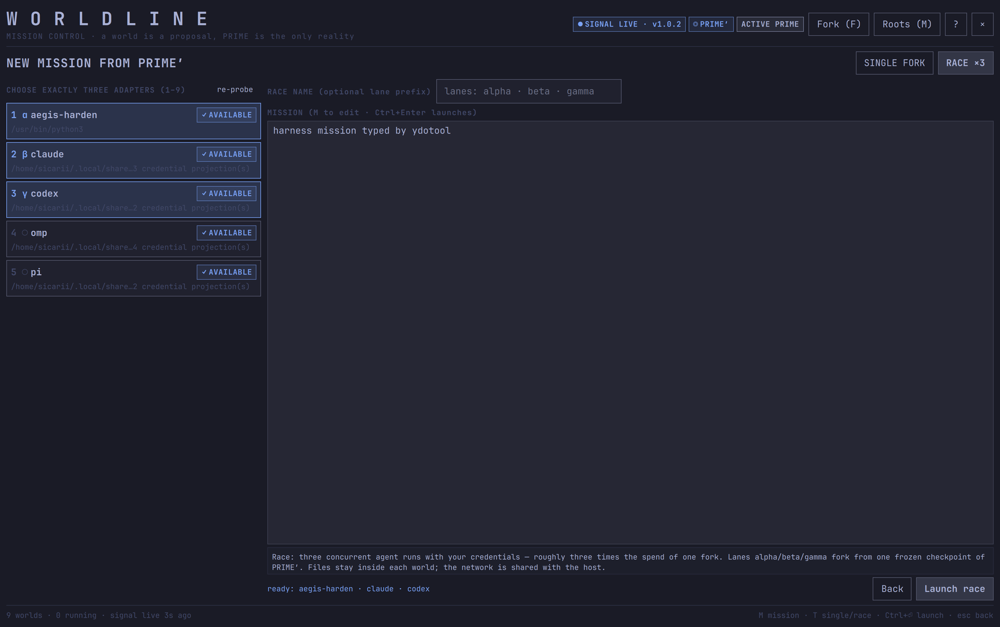
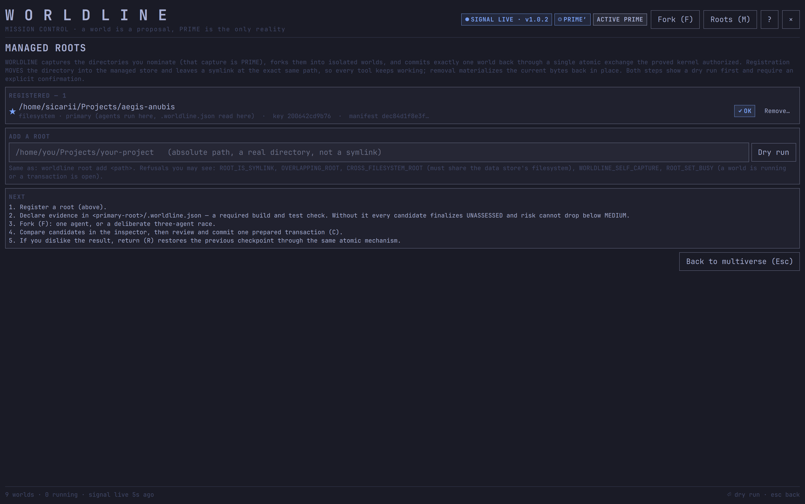
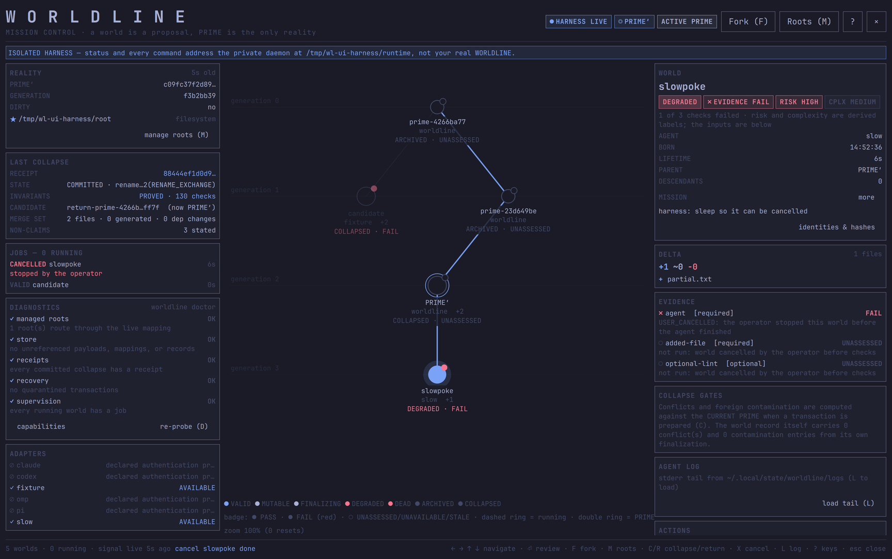

<div align="center">

# WORLDLINE for Omarchy

**Mission control for a branchable reality, in your desktop bar.**

Propose isolated worlds, run and compare agents inside them, read the evidence, review one
prepared transaction, and commit it into `PRIME` through the engine's atomic exchange — or
recover. All from one globe in the [Omarchy](https://omarchy.org) bar.


[](LICENSE)


</div>

---

## What this is

`khephri.worldline` is the Omarchy shell plugin for [WORLDLINE](../worldline): the visual,
keyboard-driven surface over the engine (`worldline` / `worldlined`). It renders the daemon's
atomically replaced `status.json` and forwards intent through the `worldline` CLI as argv
arrays. It makes no decision the engine has not authorized.

> **A world is a proposal, `PRIME` is the only reality, and no proposal becomes reality
> except through a collapse the proved kernel authorized.** The plugin never bypasses that.
> Collapse and return always prepare a fresh transaction, show you exactly what the engine
> returned, ask twice, and commit that exact transaction id.

## Surfaces

| | |
|---|---|
| **Bar** | one globe in the native icon slot, tinted by the active reality's evidence state, with a running-job badge; the tooltip reads `◉ WORLDLINE  <alias> / <agent>  +<files>  EVIDENCE <state> · <lifecycle>` |
| **Multiverse** (`SUPER+CTRL+W`) | the lineage graph with generation guides, running pulse, PRIME double ring and per-node evidence badge; a left rail (REALITY, LAST COLLAPSE, JOBS, DIAGNOSTICS, ADAPTERS); a right inspector (evidence per check, full delta, collapse gates, sibling comparison, agent log, actions) |
| **Fork** (`SUPER+SHIFT+W`, `F`) | one mission; a single fork with a chosen adapter and alias, or a deliberate three-adapter race with a lane prefix |
| **Review** (`C` / `R`) | prepare → review the engine's facts → second confirmation → commit; Escape aborts |
| **Roots** (`M`) | first-run guidance, registered roots with integrity, dry-run add/remove with confirmation |



<p align="center"> </p>

<p align="center"></p>

## Reading it honestly

Two vocabularies are kept apart on purpose:

- **Lifecycle** (engine): `MUTABLE`, `FINALIZING`, `VALID`, `DEGRADED`, `DEAD`, `ARCHIVED`,
  `COLLAPSED`. Only `VALID` can collapse. `DEAD` also covers a world whose supervision was
  lost (the reason is in the inspector's evidence).
- **Evidence** (derived from a world's checks, the same way in the bar and the cockpit):
  `PASS` (with `· N GAP` when optional checks failed — the engine's risk stays MEDIUM),
  `FAIL` (a required check failed), `UNASSESSED` (no checks, or not run), `UNAVAILABLE`
  (a check could not execute), `STALE` (the daemon heartbeat is older than 10 s; retained
  data never reads as live proof).

Risk and complexity are shown as what they are — derived labels — next to the inputs that
produced them. Conflicts and contamination are `evaluated` only on the review screen, because
the engine computes them against the *current* PRIME when it prepares the transaction.

When the daemon is offline the cockpit says **NO SIGNAL** and tells you how to check it; when
the heartbeat is stale, every consequential control is disabled and says why. A refused
collapse says `DENIED — NOTHING WAS WRITTEN` with the kernel's decision code and the paths.

## Requirements

| | |
|---|---|
| **Omarchy** ≥ 4 | the shell that hosts the plugin (`omarchy-shell` / Quickshell) |
| **Hyprland** | Wayland compositor (layer-shell overlay, key bindings) |
| **WORLDLINE engine ≥ 1.1.0** | `worldline` + `worldlined`; the plugin needs `collapse --prepare`, `transaction …`, `cancel`, `--dry-run`, and `doctor`'s integrity fields. Without the engine it renders NO SIGNAL and every action stays disabled. |

## Install

The plugin is deployed as a **git checkout** so the deployed tree is always a commit of this
repository and `omarchy plugin update khephri.worldline` keeps working.

```bash
git clone https://github.com/AnubisQuantumCipher/worldline-omarchy.git
cd worldline-omarchy
./install.sh
```

`install.sh` clones (or fast-forwards) into `~/.config/omarchy/plugins/khephri.worldline`,
validates it with `omarchy-plugin-validate`, adds the widget to `bar.layout.right` in
`~/.config/omarchy/shell.json`, writes one managed block in `~/.config/hypr/bindings.lua`
(`SUPER+SHIFT+W` fork, `SUPER+CTRL+W` multiverse, `SUPER+ALT+RIGHT` next reality), and
restarts the shell. It is idempotent and refuses to overwrite local edits in the checkout.
The engine's own `install.sh` performs the same fast-forward, so either path keeps the two in
step.

**Rollback:** `git -C ~/.config/omarchy/plugins/khephri.worldline checkout <commit>` then
`omarchy-restart-shell`. The engine installer also records the plugin commit it replaced in
its backup directory.

**Uninstall:** `omarchy plugin remove khephri.worldline` (or delete the directory and the
`khephri.worldline` entry in `shell.json`), delete the `BEGIN/END WORLDLINE` block from
`bindings.lua`, restart the shell.

## Keys

```
← → / h l    lineage (parent / child)      C / R   prepare collapse / return of the selection
↑ ↓ / k j    siblings                       X       cancel the selected running world
⏎            review (VALID) or inspect      I / S   inspect (bar + tint) / switch workspace + shell
F            fork or race                   L       load the agent's stderr tail
M            managed roots                  D       re-probe diagnostics
0            reset zoom                     ?       help          Esc  close / back / abort
fork editor: 1–9 pick adapters · M focus mission · T single/race · Ctrl+⏎ launch
review:      ⏎ final confirmation · D full hashes · Esc abort the prepared transaction
```

Mouse: click a node to select, double-click to inspect, drag to pan, wheel to zoom.

## Settings

Bar-widget settings (Omarchy `barWidget.schema`, edited inline in `shell.json`):

| Setting | Default | Effect |
|---|---|---|
| `motionEnabled` | `true` | collapse contraction animation and the running-world pulse |
| `worldTintEnabled` | `true` | full-screen tint while a non-`PRIME` world is the inspected one |

## Testing it without touching your reality

- **Fixture data** — summon with a status document and every action disabled:
  `omarchy-shell shell summon khephri.worldline '{"mode":"multiverse","fixture":true,"statusPath":"/path/status.json"}'`.
  A red banner says so; the fixture never authorizes anything.
- **Isolated harness** — a private daemon with a deterministic fixture adapter, one throwaway
  root and a VALID candidate: `tools/ui-harness.sh start`, then `tools/ui-harness.sh summon`.
  The status file *and* every `worldline` call the cockpit makes address that daemon; a blue
  banner says so, and actions are real against it. `tools/ui-harness.sh slow` adds a world to
  cancel; `stop` tears everything down. Zero model quota.

Drive keys on Wayland with `ydotool` and capture with `grim`; lint with
`qmllint -I /usr/share/omarchy/shell *.qml`.

## Architecture

| File | Role |
|---|---|
| `manifest.json` | plugin manifest: `service`, `overlay`, `bar-widget` entry points and settings schema |
| `Model.js` | pure functions: status parsing, signal/staleness, evidence derivation, sibling ranking, doctor rows, CLI error parsing |
| `WorldlineBar.qml` | the bar globe + running badge |
| `WorldlineService.qml` | headless: watches `status.json`, ghost notifications, alternate-world tint |
| `Multiverse.qml` | the cockpit: modes, keys, graph, rails, inspector, roots review, seams |
| `ForkPanel.qml` | mission creation (single fork / race) |
| `CollapsePanel.qml` | prepare → review → confirm → commit / abort |
| `WlCall.qml`, `WlCard.qml`, `WlChip.qml`, `WlKV.qml`, `WlSectionTitle.qml` | shared pieces built on `qs.Commons` / `qs.Ui` tokens |
| `tools/` | `ui-harness.sh`, `fixture_agent.py`, `slow_agent.py` |

**Data flow.** `worldlined` writes an atomic `status.json`; the plugin watches it (with a
slow reload in case an `os.replace` escapes the watcher) and parses only when the bytes
changed. Actions shell out to `worldline …` as argv, and read back the JSON the engine
returned. Colors, fonts, spacing, buttons, text fields and the confirmation dialog all come
from the shell's shared tokens and components, so the plugin follows the active theme.

## Limits worth knowing

- The plugin shows what the engine reports; it cannot see inside a running agent beyond its
  stderr tail. A world's network reach is **not** contained by the sandbox (see the engine's
  `SECURITY.md`).
- `invariantPreservation: PROVED` on a receipt means the engine's proof manifest matched the
  running library at receipt time — it is not an external attestation.
- Adapter probes and the doctor run on open and on demand; they are not streamed.

## Contributing

See [CONTRIBUTING.md](CONTRIBUTING.md). Work in a clone of this repository, deploy through
`./install.sh` (fast-forward), and keep every `Text` at `textFormat: Text.PlainText`.

## License

[MIT](LICENSE) © Khephri Labs. The WORLDLINE engine is a separate project.
