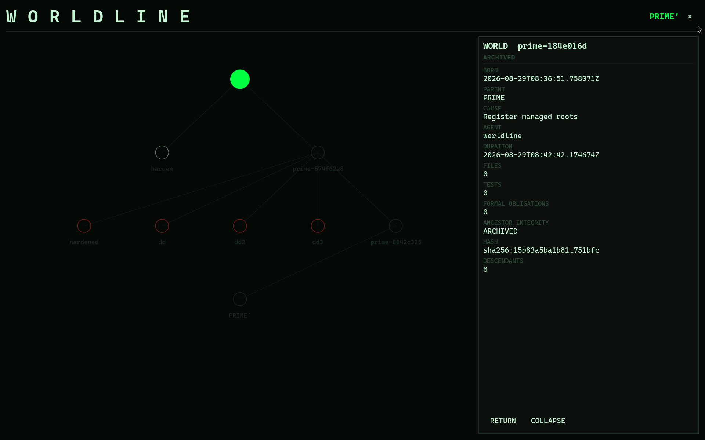
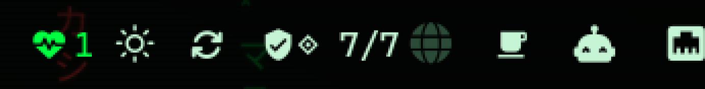

<div align="center">

# WORLDLINE for Omarchy

**A branchable-reality control surface for your desktop bar.**

Fork your working reality into isolated worlds, watch them run, and atomically
collapse the best one back into `PRIME` — all from a single globe in the
[Omarchy](https://omarchy.org) top bar.

[](LICENSE)




</div>

---

## What this is

`khephri.worldline` is the **Omarchy shell plugin** for WORLDLINE — the
visual, clickable surface. It is a thin, self-contained [Quickshell](https://quickshell.outfoxxed.me)/QML
layer that:

- puts a compact **globe** in the top bar, colored by the proof state of the
  active reality,
- opens a full-screen **multiverse graph** where every forked world is a node —
  colored by state, wired to its parent, and inspectable in a side panel,
- drives **fork**, **race**, **collapse**, and **return** through the
  `worldline` CLI, with a two-step confirmation before anything touches your
  real files.

It renders live state and forwards intent. **All authority lives in the
WORLDLINE engine** (`worldline` / `worldlined`), which decides every fork and
authorizes every collapse through a formally-proved kernel — see
[Requirements](#requirements). This repository is the desktop plugin only.

> A **world is a proposal, `PRIME` is the only reality, and the proved kernel is
> the only thing that turns a proposal into reality.** The plugin never bypasses
> that: collapse and return always go through the engine, always show you the
> exact delta first, and always stop for a confirmation.

## Screenshots

**Bar widget** — one globe, colored by proof state; full detail on hover:



**Multiverse overlay** — the fork tree, state-colored nodes, and a per-world
inspector with the base, delta, contamination, and receipt:


## Features

- **Single-glyph bar widget.** A globe in the bar's native icon slot, tinted by
  the active reality's proof state (pass / fail / neutral). The full
  reality · agent · delta · proof line lives in the hover tooltip, so it never
  crowds the bar.
- **State-legible multiverse graph.** Each world is a node colored by its real
  state — green for the live/selected line, red for failed forks
  (`DEGRADED`/`DEAD`), grey for archived/collapsed — so the whole tree reads at
  a glance. Pan, zoom, click to select, or navigate with the arrow keys.
- **Honest inspector.** The side panel shows a world's parent, cause, agent,
  delta size, checks, formal obligations, ancestor integrity, hash, and
  descendants — no invented values; unknowns render as `—`.
- **Fork / race from the desktop.** A fork editor lets you write one mission and
  launch three agents against the same frozen reality (`worldline race`).
- **Safe collapse & return.** Collapsing a world into `PRIME` (or returning to a
  checkpoint) opens a review panel with the base, candidate delta, conflicts,
  contamination, and invariant-preservation state, then requires a **second
  confirmation** before executing.
- **Alternate-world tint.** When you're standing in a non-`PRIME` world, a
  subtle full-screen tint reminds you that you're editing a proposal, not
  reality. (Toggleable.)
- **Theme-native.** Colors, fonts, and spacing come from Omarchy's shared
  `qs.Commons` / `qs.Ui` tokens, so the plugin adopts your active theme
  automatically — no hard-coded palette.

## Requirements

| | |
|---|---|
| **Omarchy** | the shell that hosts the plugin (`omarchy-shell` / Quickshell). |
| **Hyprland** | Wayland compositor (for the layer-shell overlay + keybinds). |
| **Python 3** | used by `install.sh` to edit `shell.json` (not at runtime). |
| **WORLDLINE engine** | `worldline` + `worldlined` — the daemon that owns `PRIME`, forks worlds, and authorizes collapses. **The plugin is a UI over this engine and shows no data without it.** |

The plugin reads the engine's atomic status file at
`$XDG_RUNTIME_DIR/worldline/status.json` (schema v1) and invokes `worldline`
subcommands (`fork`, `race`, `collapse`, `return`). The engine itself is a
separate project and is not included here.

## Install

```bash
git clone https://github.com/AnubisQuantumCipher/worldline-omarchy.git
cd worldline-omarchy
./install.sh
```

`install.sh` copies the QML into `~/.config/omarchy/plugins/khephri.worldline`,
adds the widget to the right section of `~/.config/omarchy/shell.json`, binds
the keys in `~/.config/hypr/bindings.lua` (a managed block), and restarts the
shell. It is idempotent.

<details>
<summary>Manual install</summary>

```bash
# 1. copy the plugin
mkdir -p ~/.config/omarchy/plugins/khephri.worldline
cp *.qml manifest.json ~/.config/omarchy/plugins/khephri.worldline/

# 2. enable the bar widget: add { "id": "khephri.worldline" } to
#    bar.layout.right in ~/.config/omarchy/shell.json

# 3. (optional) keybinds in ~/.config/hypr/bindings.lua:
#    o.bind("SUPER + CTRL + W",  "WORLDLINE: multiverse",
#           "omarchy-shell shell summon khephri.worldline '{\"mode\":\"multiverse\"}'")
#    o.bind("SUPER + SHIFT + W", "WORLDLINE: fork reality",
#           "omarchy-shell shell summon khephri.worldline '{\"mode\":\"fork\"}'")

# 4. reload
omarchy-shell shell rescanPlugins && ~/.local/share/omarchy/bin/omarchy-restart-shell
```
</details>

To uninstall: remove `~/.config/omarchy/plugins/khephri.worldline`, delete the
`khephri.worldline` entry from `shell.json`, delete the `BEGIN/END WORLDLINE`
block from `bindings.lua`, and restart the shell.

## Usage

- **Click the globe** in the bar to open the multiverse graph.
- **`SUPER + CTRL + W`** — open the multiverse graph.
- **`SUPER + SHIFT + W`** — open the fork editor (write a mission, launch a race).
- Inside the graph: **arrow keys** move selection along the tree
  (←/→ parent/child, ↑/↓ siblings), **click** selects a node, **drag** pans,
  **scroll** zooms.
- **`Enter`** on a selected `VALID` world opens the collapse review.
- **`Esc`** closes the overlay.

## Configuration

The bar widget exposes two settings (Omarchy plugin `barWidget.schema`):

| Setting | Default | Effect |
|---|---|---|
| `motionEnabled` | `true` | Collapse animation on the graph. |
| `worldTintEnabled` | `true` | Full-screen tint while standing in a non-`PRIME` world. |

## Architecture

| File | Role |
|---|---|
| `manifest.json` | Omarchy plugin manifest — declares the `service`, `overlay`, and `bar-widget` entry points and the widget settings schema. |
| `WorldlineBar.qml` | the bar widget: a `BarIconButton` globe, state-colored, with the full status in its tooltip; click summons the overlay. |
| `Multiverse.qml` | the full-screen overlay: fork editor, the multiverse graph (Canvas), and the per-world inspector. |
| `CollapsePanel.qml` | the two-step collapse/return review + confirmation. |
| `WorldlineService.qml` | background service: watches `status.json`, raises "a better future was found" notifications, and paints the alternate-world tint. |

**Data flow.** `worldlined` writes an atomic `status.json`; the plugin watches it
via `FileView` (with a short debounce and last-known-good fallback so a mid-write
read never flashes a partial state) and renders it. Actions shell out to the
`worldline` CLI. Pixels only — the plugin makes no decisions the engine hasn't
authorized.

## Contributing

Issues and PRs are welcome — see [CONTRIBUTING.md](CONTRIBUTING.md). The plugin
is pure QML with no build step: edit a file, `omarchy-restart-shell`, and the
change is live.

## License

[MIT](LICENSE) © Khephri Labs.

The WORLDLINE **engine** (daemon, CLI, and formally-proved collapse kernel) is a
separate project with its own licensing and is not distributed here.
